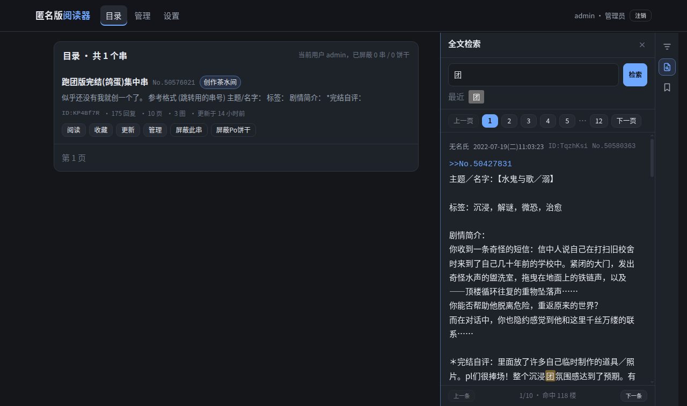
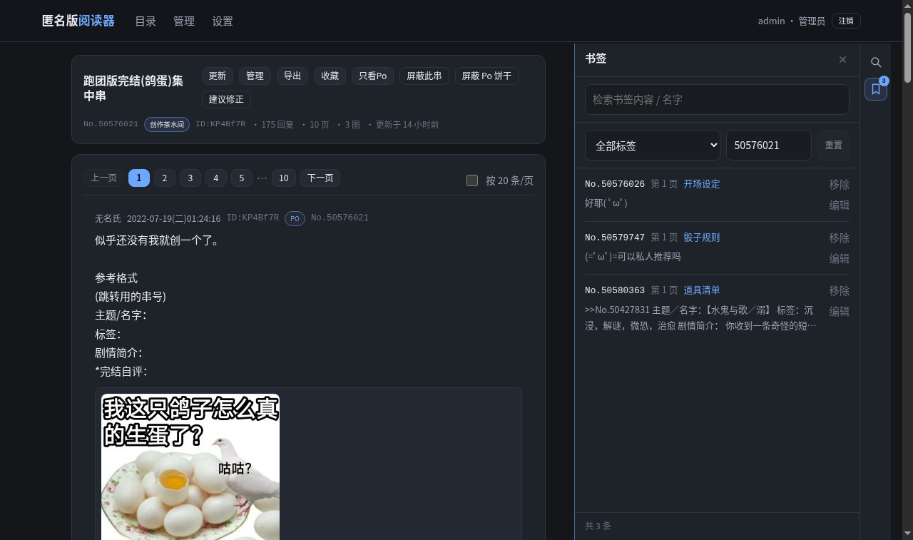
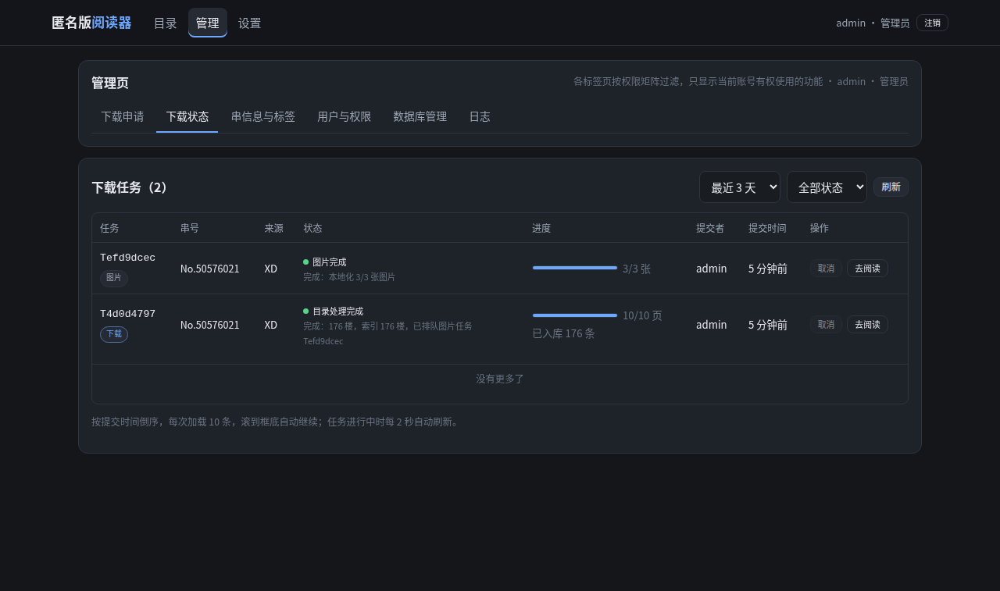

# 匿名版阅读器

[](LICENSE)


匿名版阅读器：**下载 → 入库 → 整理 → 检索 → 阅读**。
本项目为一个可自部署的 Web 应用：
用户系统与权限、下载队列与状态机、全文检索、管理页、黑名单、标签与数据管理。

> 抓取内容需要自行导入 Cookie；请遵守目标站点的条款与当地法律，详见[免责声明](#免责声明)。







---

## 实现

| | |
| --- | --- |
| 技术栈 | Python 3.11+ / FastAPI / SQLAlchemy 2 · React 18 + TypeScript + Vite |
| 数据层 | **关系库**（SQLite 默认 / PostgreSQL / MySQL）是事实来源 ＋ **检索引擎**（FTS5 默认 / Manticore）是可重建的派生索引，见 [`docs/architecture.md`](docs/architecture.md) |
| 文档 | 接口契约 [`docs/contract.md`](docs/contract.md) · 权限 [`docs/permissions.md`](docs/permissions.md) · 任务状态机 [`docs/state-machine.md`](docs/state-machine.md) · 部署 [`deploy/`](deploy/) |
| 状态 | 功能完整可用、处于 Beta；SQLite + FTS5 与 PostgreSQL + Manticore 两套组合都实机跑过 |

### 功能

- **下载**：提交串号排队 → 抓页 → 入库 → 建索引；连接复用 + 页并发（默认 4，可调）；增量更新只补新页；
  图片本地化是**独立任务**，不堵下载队列。来源目前只支持 **X岛（XD）**，AWD / BOG 尚未接入
- **阅读**：按岛页码 / 每页固定条数分页、只看 Po（同串里与串首 ID 相同即楼主）、打开串自动回到上次读到的那一楼、
  引用预览（`>>No.123`、`>>123`、`No.123` 都能点开，可逐级往回看）、图片本地直出、暗色主题与亮度调节、收藏、屏蔽饼干/串
- **工具栏**：目录页与阅读页共用一套（只放图标的竖栏 + 面板，展开时正文让位、不遮内容）。
  阅读页是「串内检索」「书签」，目录页是「目录筛选」「全文检索」「书签」；
  书签按用户和串分开，可命名、可按标签或串号筛，和检索结果一样能一键在新标签页打开
- **检索**：全文检索（FTS5 trigram 或 Manticore ngram+CJK）、板块/标签/类型/系列/状态/串号筛选、命中结果分页；
  检索词按空格分词（各词都要出现），英文双引号内的整段完全匹配；命中数超过上限会明确提示被截断；
  命中列表不放图，正文占固定高度、可展开收起
- **导出**：Word（.docx）/ PDF，可选是否内嵌图片与图片质量；排版复用姊妹项目
  [nmb-exporter](https://github.com/K-02-b/nmb-exporter) 的 `export.py`
  （`backend/app/services/nmb_export.py`，按 commit 固定的原样副本），也保留 Markdown / JSON 接口
- **管理**：下载状态、串信息与标签（模糊匹配候选）、用户与权限、邀请码（可用次数 / 已注册人数 / 有效期 / 启停）、
  数据库备份与清理、日志
- **账号**：邀请码注册、自助改密码、登录失败锁定、按权限显示管理组件；抓取 Cookie 加密存储、按人取用、永不回显

---

## 安装

拉取代码：

```bash
git clone https://github.com/K-02-b/nmb-reader.git
cd nmb-reader
```

### A. 轻量版本（单机直跑 SQLite + FTS5，零外部依赖）

需要 Python 3.11+、Node.js 18+、npm、make。

```bash
make setup                       # 建 venv + 装后端依赖 + 装前端依赖
make build                       # 构建前端产物（后端会直接托管 frontend/dist）
make init-db                     # 建表 + 建管理员
make build-index                 # 建全文索引
make dev                         # → http://127.0.0.1:8080
```

首次登录 `admin`，口令取
`THREAD_READER_ADMIN_PASSWORD`（未设置时为 `admin`），**登录后请立刻改掉**
（也可以在「设置 → 账户与权限」里自助改）：

```bash
make users ARGS="--user admin --password '新口令'"
```

### B. 本地开发（前端热更新 + 真实后端）

环境要求同 A。

```bash
make setup && make init-db
make dev                     # 终端 1：后端 :8080（托管 frontend/dist）
cd frontend && npm run dev   # 终端 2：前端 :5177，/api 反代到 8080，改前端即时生效
```

### C. 容器化部署

需要 Docker 24+ 与 Docker Compose v2。

**本地 / 单机**：SQLite + FTS5，零外部依赖

```bash
cp .env.example .env
make up-local      # 构建并启动 api + worker
make init-local    # 建表 + 管理员 + 建 FTS5 索引
```

**服务器**：PostgreSQL + Manticore（多人使用推荐）

```bash
cp .env.example .env
$EDITOR .env       # 至少改 POSTGRES_PASSWORD / THREAD_READER_ADMIN_PASSWORD
make up            # 构建并启动 db + search + api + worker
make init-compose  # 首次初始化：建表 + 管理员 + 重建检索索引
```

两者用同一个镜像，只差两个数据层；`make down` 一次停掉。
细节见 [`deploy/docker/README.md`](deploy/docker/README.md)；裸机（systemd + nginx）见
[`deploy/DEPLOY_SERVER.md`](deploy/DEPLOY_SERVER.md)。

> PDF 导出用的中文字体（15MB）体积大，**没有放进仓库**：`make setup` 会自动取回，
> 容器镜像在构建时取回；单独补取用 `make fetch-fonts`。

### 验证

```bash
curl -s localhost:8080/api/health
# 单机直跑 / 容器单机：db=sqlite search=fts5；容器形态 worker 是独立容器，所以是 false
# {"ok":true,"db":"sqlite","search":"fts5","worker":true,"images":true}
curl -s localhost:8080/api/threads | head -c 120     # 目录列表
curl -s -G --data-urlencode 'keyword=大洛山' localhost:8080/api/search/fulltext | head -c 120
curl -s localhost:8080/api/search/status
# {"backend":"fts5","fts5":true,"indexedPosts":0,"db":"sqlite"}
```

浏览器打开 <http://127.0.0.1:8080>，用 `admin` 和你设的口令登录。

---

## Cookie 设置

- Cookie 由用户自己导入，每个用户导入的 Cookie **只会用于该用户提交的任务**
- 加密存储（Fernet，主密钥来自 `THREAD_READER_SECRET_KEY`，留空则自动生成 `data/secret.key`，权限 600）
- **接口永不回显** Cookie 内容，日志与任务消息里也不出现
- 服务端可选全局 `THREAD_READER_NMB_COOKIE`，只建议自用实例用；用户自己导入的优先
- 没导入就提交下载，任务会失败并提示去「设置 → Cookie」导入；粘贴时认 `userhash=`，也可以粘贴整段

---

## 仓库结构

```text
.
├── README.md                 本文件
├── Makefile                  所有常用命令入口（make help）
├── compose.yaml              服务器形态：PostgreSQL + Manticore + api + worker + init
├── compose.sqlite.yaml       单机形态：SQLite + FTS5 + api + worker + init
├── .env.example              compose 用的环境变量模板
├── .markdownlint.json        markdown 规则（make lint-md）
├── backend/                  FastAPI 服务 + 下载 worker
│   ├── app/
│   │   ├── assets/fonts/     PDF 用的中文字体（make fetch-fonts 下载，不入库）
│   │   ├── main.py           应用装配（路由顺序 / SPA 回退 / 内置 worker 开关）
│   │   ├── models.py         SQLAlchemy 模型（表结构的唯一来源）
│   │   ├── routers/          auth · me · admin · assets · downloads · search · threads
│   │   └── services/         nmb_parse · importer · search · queue · images · exporter · nmb_export · maintenance
│   ├── scripts/              init_db / build_index / manage_users / reset_data / reparse / backfill_board
│   ├── pyproject.toml        包元数据与 ruff 配置
│   └── requirements.txt      运行期依赖（锁定版本，镜像用它）
├── frontend/                 React SPA（Vite + TS）
│   ├── public/               favicon 等原样复制的静态文件
│   └── src/
│       ├── api/              契约类型与唯一数据入口
│       ├── components/       通用组件
│       ├── pages/            登录 / 目录 / 阅读 / 管理 / 设置
│       └── styles/           设计令牌与样式（按层拆分，index.css 汇总）
├── docs/
│   ├── architecture.md       两层数据职责与数据流
│   ├── contract.md           API 契约 / 分页语义 / 错误码
│   ├── permissions.md        权限矩阵与账号被锁时的处理
│   ├── state-machine.md      下载任务状态机
│   └── images/               README 里的截图
├── deploy/
│   ├── docker/               Dockerfile · init.sh · 容器部署说明
│   ├── systemd/              api/worker 单元文件 + env 模板
│   ├── nginx/                反向代理样例（含 SSE 关缓冲）
│   └── DEPLOY_SERVER.md      裸机部署手册
└── SECURITY.md               安全说明：Cookie/密钥怎么存，怎么报告问题
```

---

## 常用命令

```bash
make help                                      # 所有目标
make setup / build / dev                       # 安装 / 构建前端 / 起服务
make init-db / build-index                     # 初始化数据库（顺带给老库补新增列） / 重建全文索引
make reparse ARGS="--thread 59775198"          # 按当前解析规则重刷已入库的正文（改完解析要跑，之后记得 build-index）
make backfill-board                            # 老数据回填板块（每个串只抓第 1 页）
make users ARGS="--list"                       # 账号与邀请码管理
make users ARGS="--unban admin"                # 解除封禁/停用（唯一管理员被自动封禁时用这个）
make reset-data ARGS="--yes"                   # 清空内容数据（保留账号与设置）
make lint-md                                   # 检查 markdown 写法（规则见 .markdownlint.json）
make up / init-compose / down / logs / ps      # Docker Compose（服务器形态）
make up-local / init-local / logs-local        # Docker Compose（单机形态）
```

---

## 许可

[AGPL-3.0-or-later](LICENSE)

## 免责声明

本项目是**论坛阅读工具**，仅用于对公开可见的论坛内容提供更便捷的阅读服务。请遵守目标站点的
robots 条款/服务条款与当地法律。

请勿大规模爬取。作者不对使用者的行为负责。
