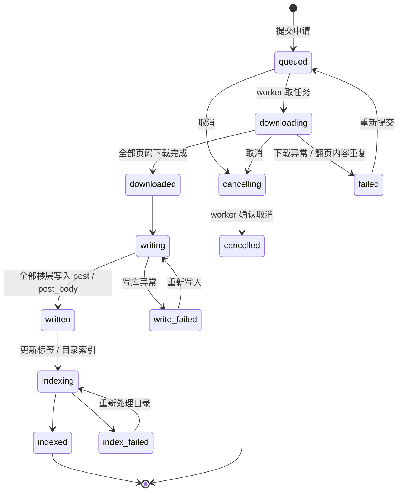

# 下载任务状态机与队列约定

一句话：**任务状态只有一份，就是 `download_task` 表里的那份**——API 只写队列，worker 独立消费，
重启不丢任务。前端用 `GET /api/downloads` 轮询或 `GET /api/downloads/stream`（SSE）拿状态。

## 两类任务

| kind | 做什么 | 状态流 |
| --- | --- | --- |
| `download` | 抓页 → 入库 → 建索引 | `queued → downloading → downloaded → writing → written → indexing → indexed` |
| `images` | 把某个串的图片本地化（下载任务完成后、确实还有缺图才自动排队） | `queued → images_running → images_done`（失败 `images_failed`） |

**为什么拆开**：图比页慢得多（一个串的图能下几十分钟），挂在下载任务里会把整个队列堵死，
而**缺图时前端本来就会回源图床**，不影响阅读。另外 `claim_next` 让 `download` 优先于 `images`，
所以补图不会挡住别人下串。图片任务复用 `page` / `total_pages` 表示「已本地化 / 待本地化张数」；
图片都已经在本地时不会再排任务。

## 状态与转移

## 状态对应的用户可见信息

| 状态 | 文案 | 可执行操作 |
| --- | --- | --- |
| `queued` | 已提交 | 取消（并显示前面还有几个任务） |
| `downloading` | 下载中 | 取消 |
| `downloaded` | 下载完成 | 取消 |
| `writing` | 写入中 | — |
| `written` | 写入完成 | 去阅读 |
| `indexing` | 目录处理中 | — |
| `indexed` | 目录处理完成 | 去阅读 |
| `cancelling` / `cancelled` | 取消中 / 取消完成 | — |
| `failed` | 下载失败 | 重新提交 |
| `write_failed` | 写入失败 | 重新写入 |
| `index_failed` | 目录处理失败 | 重新处理目录 |

## 队列与并发约定

1. 下载任务之间**串行**执行，队列顺序 = 提交时间顺序，`ahead` 由后端计算。
   **单个任务内部**可以并发抓页（`THREAD_READER_FETCH_CONCURRENCY`，默认 4，用户可调），
   每个通道之间仍保留 `THREAD_READER_FETCH_PAUSE` 间隔，对站点的速率 ≈ 并发度 / 间隔。
   抓取复用 keep-alive 连接；图片另用 `THREAD_READER_IMAGE_CONCURRENCY` 并发下载。
2. 同一串不允许同时存在两个未结束任务；重复提交返回 `409 TASK_EXISTS`。
3. 串已存在且来源为 `XD` 时自动降级为**增量更新**：只补最后一页及之后，任务 `message` 注明。
4. API 进程只写队列表，`worker` 独立进程消费。**worker 启动时会把上次异常退出遗留的
   「进行中」任务重新排队**（消息标注「上次下载中断，已自动重新排队」）。下载本身幂等。
5. 取消是**协作式**的：置为 `cancelling`，worker 在当前页边界检查后终止并置 `cancelled`。

## Cookie 失效怎么判断

1. **下载前预检**：用提交者的 Cookie 访问受限板块（默认「速报2」），匿名拿不到串列表 →
   立刻失败并写明原因。
2. **下载中兜底**：按「翻页拿到的楼层 ID 是否重复」判断。
3. 页数多不是 Cookie 问题：`THREAD_READER_FETCH_MAX_PAGES`（默认 2000）只是防止误输入串号
   的安全阀，超出时报 `PAGE_LIMIT_EXCEEDED` 而不是 `COOKIE_INVALID`。
